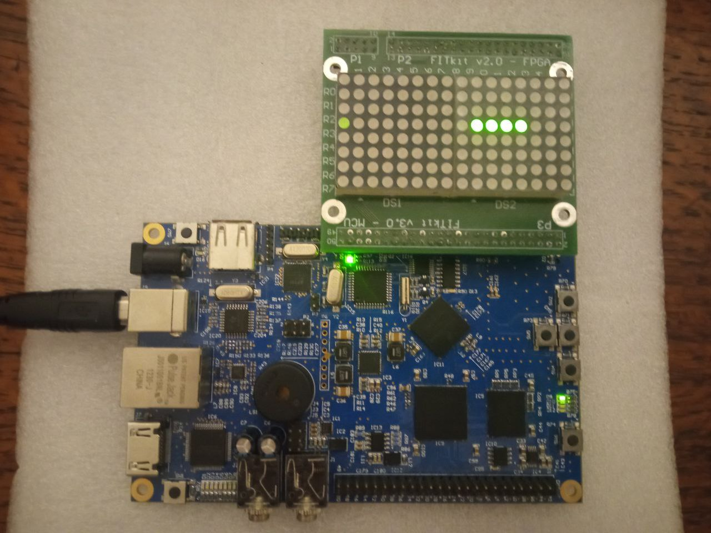

# Arcade game "Snake" on FitKit3 platform
## Project description
The aim of this project is to implement arcade "Snake" game on FitKit3 platform that utilizes `Kinetis K60` microcontroller.

The only other HW components used are two LED displays `KWM-30881AGB`. Each display has the dimensions of `8x8` but as they are arranged in a row next to each other they add up to `8x16` (8 ROWS, 16 COLUMNS).
The mentioned displays are used to displaPy the game field.

Displays and FitKit3 are connected through the `50 pins` of connector `P1` (on FitKit3 side) and connector `P3` (on display side).

Display is controller by 8 row pins (`R0...R7`) and 4 column multiplexer pins (`A0...A3`).
A row is set ON by bringing a log. 1 to the corresponding pin. 
A column is set ON by bringing the correct bit combination to the multiplexer pins.
So to set a cell with at [3, 14] ON, the following should be done:

`R4 <- 1;`

`A0 <- 1; A1 <- 1; A2 <- 1; A3 <- 0;`

## Implementation
The program is implemented in C programming language using `Kinetis Design Studio 3.0.0 IDE`.

The whole program is contained in a single source file: `main.c`.
The only header files used are: `MK60D10.h, core_cm4.h, stdlib.h, time.h`.

First step of the program is to initialize the hardware.

The process of hardware initialization can be described by the following steps:

1. For each port in use the corresponding clock must be enabled through `SIM_SCGC5` register.
2. Every pin `n` of port `x` in use must be set for **GPIO functionality**. This is done by setting `PORTx_PCRn` MUX to `0x1`: `PORTx_PCRn = PORT_PCR_MUX(0x01);`. For the buttons interrupt detection is also enabled to detect when they are pressed: `PORTx_PCRn |= PORT_PCR_IRQC(0b1010);`.
3. Every pin `n` of port `x` in use must be set either for write(`1`) or read(`0`) functionality through `PORTx_PDDR` register.

These individual steps are repeated for `PORTA`, `PORTB` and `PORTE`.

The hardware is initialized in the following functions:

* `void init_leds(void)` - initialize LEDs.

* `void init_buttons(void)` - initialize buttons.

* `void init_display(void)` - initialize the display by setting `EN` pin of column MUX to `0` (enabled) and configuring all row and column pins to GPIO, write functionality.

* `void init_pit(void)` - initialize `PIT` (Periodic Interrupt Timer) by setting the corresponding bit in `NVIC_ISER2`, enabling the clock, turning the PIT ON etc. The trigger interval is loaded into `PIT_CHANNEL0.LDVAL` register. Knowing the desired trigger period and clock period, the value that must be loaded into LDVAL can be calculated like that: `LDVAL = (period / clock_period) - 1`. PIT clock frequency is `50MHz`.

* `void init(void)` - a function that calls all the previously mentioned `init` functions.

The game logic is defined by the following functions:

* `void game_display_field(uint field[NUM_ROWS][NUM_COLS], uint dly)` - displays the `8x16` game field.

* `void game_restart(int lost)` - starts/restarts the game. Shows initial text on display, clears the field, resets global variables.

* `int  game_snake_collide(pos_t head_pos)` - checks for snake collision with food and itself. In case food is touched, snake size is increased by 1 in the direction of tail.

* `void game_snake_update(void)` - updates snake position based on its current movement direction. It is done by sequentially moving the elements of the snake body array.

* `void game_spawn_food(void)` - generates a random position on field until the generated position is not occupied. The cell on generated position is assigned a value of 2, which indicates that the cell is occupied by food.

* `void game_update(void)` - calls functions like `game_snake_update` and `game_spawn_food` to update the game.

The snake direction is controller by buttons which state is tested in `irq_button_handler` function.
This function is called from `PORTE_IRQHandler` which is function that gets called on each `PORTE` interrupt.

`PIT0_IRQHandler` is called when `PIT` produces interrupt. `game_update` is called from this function to update the game.

## Testing
The program was manually tested by playing the game using the buttons on FitKit3 platform.

## Extensions
The project task only required to implement the snake movement without any other game logic.

In my implementation the game was extended with the following functionality:

1. Food spawning.
2. Snake body length increased when picking up food.
3. Game is lost when snake collides with itself.
4. Text displayed on program start and game loss.

